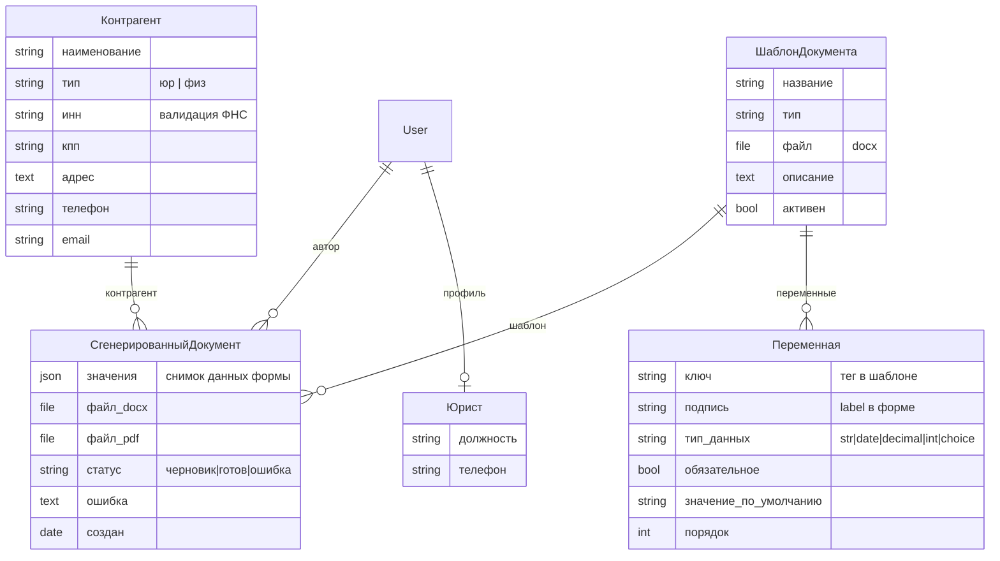
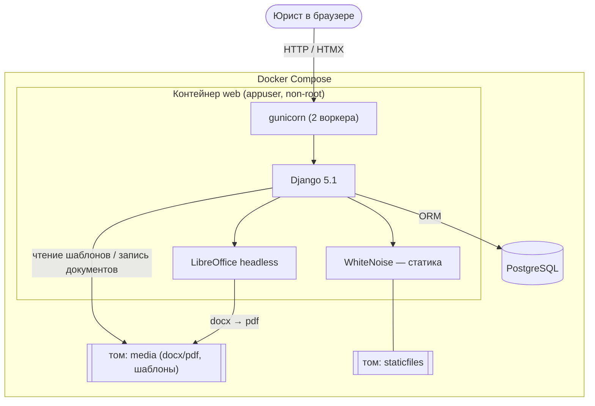
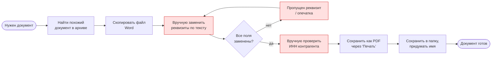
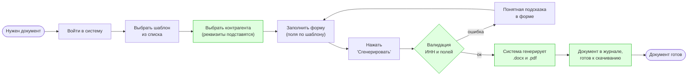
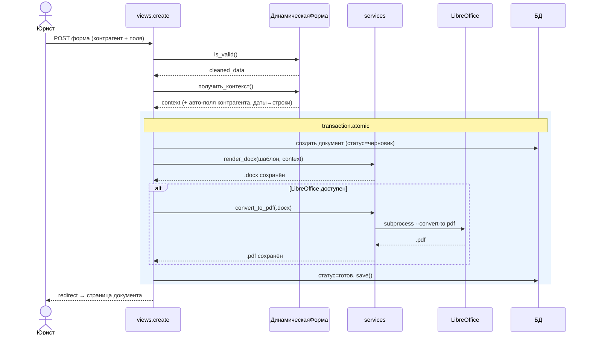
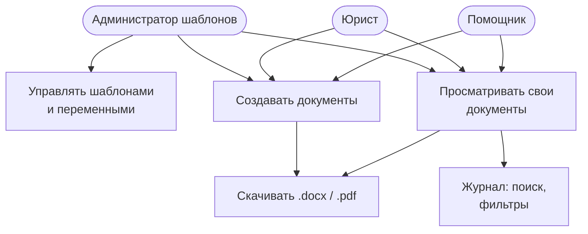
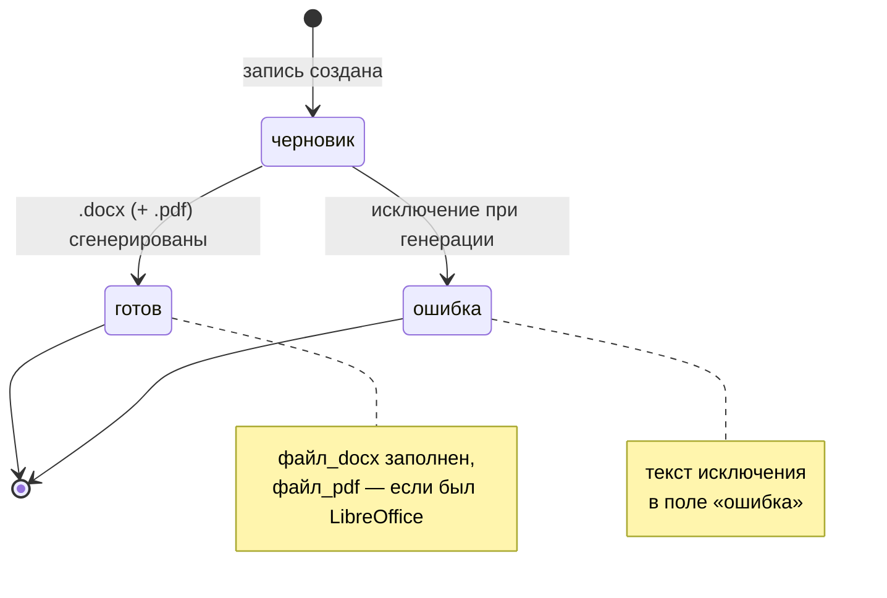

# Схемы проекта

Диаграммы в формате [Mermaid](https://mermaid.js.org/). Рендерятся автоматически:
- в **PyCharm/IDEA** — превью Markdown (плагин Mermaid встроен),
- на **GitHub/GitLab** — прямо в просмотре файла,
- онлайн — вставить код в [mermaid.live](https://mermaid.live) и экспортировать в PNG/SVG для слайдов.

Содержание:
1. [ER-диаграмма (модель данных)](#1-er-диаграмма-модель-данных)
2. [Архитектура развёртывания](#2-архитектура-развёртывания)
3. [BPMN AS-IS — процесс без системы](#3-bpmn-as-is--процесс-без-системы)
4. [BPMN TO-BE — процесс с системой](#4-bpmn-to-be--процесс-с-системой)
5. [Sequence — генерация документа](#5-sequence--генерация-документа)
6. [Use case — роли и действия](#6-use-case--роли-и-действия)
7. [Состояния документа](#7-состояния-документа)

---

## 1. ER-диаграмма (модель данных)



> FK к шаблону, контрагенту и автору используют `on_delete=PROTECT` — нельзя
> удалить объект, по которому уже есть сгенерированные документы.

---

## 2. Архитектура развёртывания



---

## 3. BPMN AS-IS — процесс без системы

Как юрист готовит документ вручную (текущее состояние):



**Проблемы AS-IS:** ручная замена реквизитов → опечатки и пропуски; нет проверки
ИНН; копии шаблонов расходятся по версиям; документы теряются в папках; нет журнала.

---

## 4. BPMN TO-BE — процесс с системой



**Выгоды TO-BE:** автоподстановка реквизитов; автоматическая проверка ИНН;
единый источник шаблонов; журнал с поиском; .docx и .pdf одним действием.

---

## 5. Sequence — генерация документа



> Любое исключение внутри блока → `статус=ошибка`, текст в поле `ошибка`;
> транзакция гарантирует отсутствие «висячих» черновиков при сбое.

---

## 6. Use case — роли и действия



> Каждый пользователь видит и скачивает **только свои** документы
> (`автор=request.user`). Суперпользователь проходит любую проверку доступа.

---

## 7. Состояния документа



---

## Экспорт в изображения

Для вставки в презентацию:

1. **Онлайн (быстро):** открыть [mermaid.live](https://mermaid.live), вставить код
   блока, нажать **Actions → PNG/SVG**.
2. **Локально (если есть Node.js):**
   ```bash
   npm install -g @mermaid-js/mermaid-cli
   mmdc -i docs/DIAGRAMS.md -o docs/diagram.png
   ```
